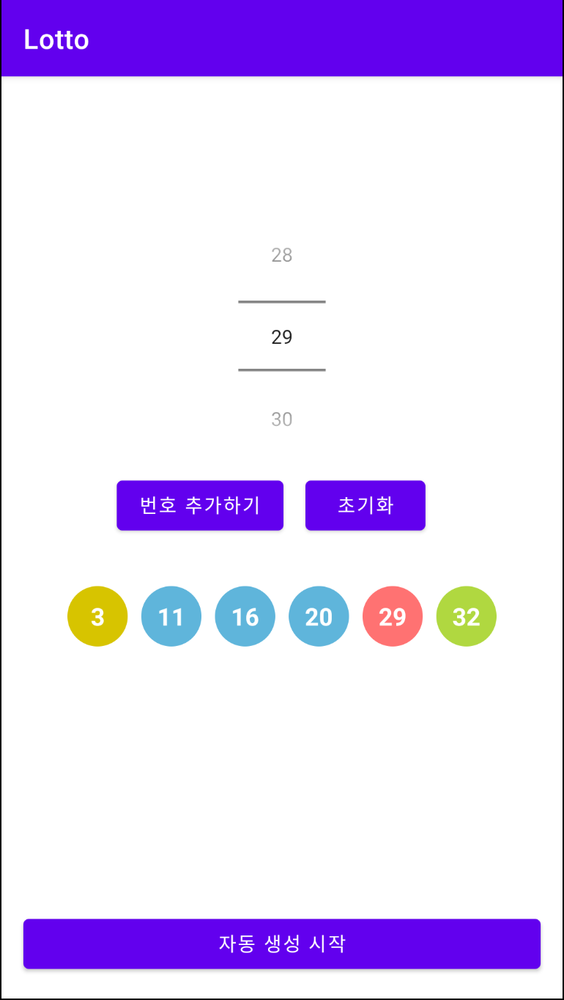

# 로또 번호 추첨기

# 결과화면

# 이 프로젝트를 통해 배우는 것

- **Layout** 을 그리는 법
  - **ConstraintLayout** 사용하기
  - **NumberPicker** 의 속성들과 사용하는 법
  - **TextView** 의 속성들과 사용하는 법 (복습)
  - **Button** 사용하는 법 (복습)
- **Layout** 과 **Kotlin** 코드를 함께 사용하기
- **버그** 수정해보기
- 중복 코드 정리하기
- Shape Drawable 사용하기 
  - (https://developer.android.com/guide/topics/resources/drawable-resource#Shape)

### Kotlin 문법

apply

When

Random

Collection

	- Set, List

람다함수

### 로또 번호 추첨기

0~5개까지 수동 선택 가능하도록 구현하기

수동선택한 번호를 제외한 나머지 번호는 랜덤으로 표시하기

